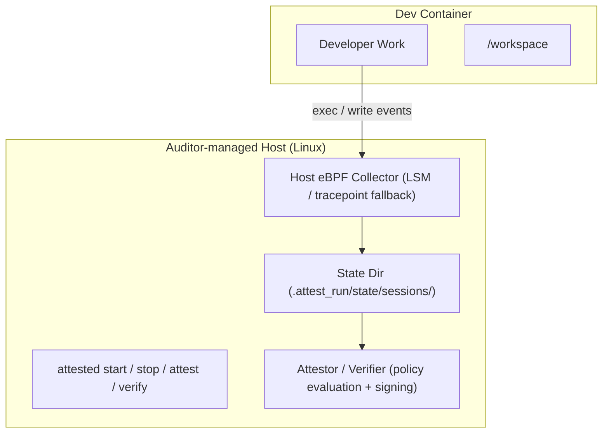

# Project Overview

[English](./PROJECT_OVERVIEW.md) | [日本語](docs/jp/PROJECT_OVERVIEW.md)

This document collects detailed project-level context that was moved out of top-level README.

## Status (PoC)

- Primary verdict: `forbidden_exec`
- Supplementary verdict: `forbidden_writers`
- Lineage-aware extension: `forbidden_exec_lineage_writes`

## Audit Results (WebUI)

SessionAttested stores and visualizes:
- `audit_summary.json`
- `attestation.json`
- `ATTESTED_SUMMARY`
- `ATTESTED_WORKSPACE_OBSERVED`
- `.attest_run/reports/sessions/<SESSION_ID>/session_correlation.json`

Typical WebUI cards:
- Attestation / Verification
- Audit Summary
- Executed / Writer identities
- Workspace Files -> Writers (Session)
- Files Touched by Forbidden Exec Lineage (Session)
- Commit Files -> Writers (Session)

Example screenshots:

Session list and PASS/FAIL overview:

FAIL-case detail view:

Commit correlation view:

## Audit Architecture (PoC)

## Scope

What it provides:
- host-side session auditing (`exec`, workspace write)
- commit binding
- signed attestation + verify
- policy-based pass/fail

What it does not prove:
- absolute non-use of tools outside audited environment
- code quality or authorship by itself

## Use Cases

- prohibited tool detection and verification
- portfolio/hiring process evidence (supplementary)
- outsourced development process controls
- training/exam supplementary auditing
- internal compliance workflows

## Strengths (vs conventional methods)

SessionAttested is a complementary layer to EDR/XDR, network controls, and CI static checks.

Key value:
- session-level scoping
- process evidence close to actual development actions
- commit-linked, signed, verifiable outputs

## Related Docs

- [`ATTESTATION_FLOW.md`](ATTESTATION_FLOW.md)
- [`ATTESTATION_SCHEMA_EXAMPLES.md`](ATTESTATION_SCHEMA_EXAMPLES.md)
- [`EVENT_COLLECTION.md`](EVENT_COLLECTION.md)
- [`SIGNING_AND_TAMPER_RESISTANCE.md`](SIGNING_AND_TAMPER_RESISTANCE.md)
- [`THREAT_MODEL.md`](THREAT_MODEL.md)
- [`POLICY_GUIDE.md`](POLICY_GUIDE.md)
