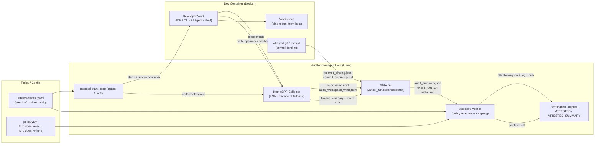

# SessionAttested

[English](./README.md) | [日本語](docs/jp/README.md)


English docs for SessionAttested. For the Japanese version, see [`docs/jp/README.md`](docs/jp/README.md).

**SessionAttested** is a **policy-based development-session attestation framework** that observes, from the host side (LSM/eBPF), which processes were executed and which executable identities wrote to a development workspace during a session, then binds the result to commits and outputs a signed attestation.

It can be used as a foundation for verifiable development-session auditing and policy enforcement workflows.

## Status

- **Project status:** PoC
- **Current focus:** verifiable auditing for dev-container sessions (`exec` / `workspace write`) with policy-based attestation
- **Primary verdict (PoC):** `forbidden_exec`
- **Supplementary verdict (PoC):** `forbidden_writers`

## Start Here

- Quick trial (build + run): [`POC_QUICKSTART.md`](POC_QUICKSTART.md)
- End-to-end flow (actors + commands): [`ATTESTATION_FLOW.md`](ATTESTATION_FLOW.md)
- Output formats (what files are generated): [`ATTESTATION_SCHEMA_EXAMPLES.md`](ATTESTATION_SCHEMA_EXAMPLES.md)
- Concrete fail-case example (Codex write session): [`POC_EXAMPLE_CODEX_SESSION.md`](POC_EXAMPLE_CODEX_SESSION.md)

## Audit Architecture (PoC)



What this shows (at a glance):

- **Where the audit runs:** on the host, not inside the container
- **What is observed:** `exec` + writes under `/workspace`
- **What gets aggregated:** raw logs + session summary + `event_root`
- **What gets produced:** signed attestation and verification outputs (`ATTESTED`, `ATTESTED_SUMMARY`)

## Background

Modern development environments use many tools (AI agents, code generators, downloaders, custom scripts). It is often difficult to explain later, objectively, which processes ran and which tool actually modified the workspace.

SessionAttested aims to present machine-verifiable claims such as:

- workspace writes occurred only from allowed process identities
- prohibited tools (including AI agents) were not observed in the audited session
- audit results were aggregated and signed in a tamper-resistant form

## Scope

### What the PoC aims to provide

- Host-side auditing for a containerized development environment (Docker in the PoC), including:
  - `exec` events
  - write operations under `/workspace`
- Signed attestation generation bound to a commit SHA
- Policy-based session pass/fail (`forbidden_exec`, `forbidden_writers`)
- Output format suitable for local verification and GitHub Artifact publication

### What this project does not prove

- General proof that a user “never used” certain tools anywhere
- Copy/paste detection or prompt history tracking
- Integrity of self-hosted machines controlled by the user

## Current PoC Value

Even as a PoC, SessionAttested provides practical, high-confidence evidence and a usable verification flow:

- separate auditing of `exec` and `workspace write`
- reproducible fail judgments using `forbidden_exec` tied to real sessions and commits
- signed `attestation` + `verify` + `ATTESTED_SUMMARY` outputs
- workable identity resolution in realistic environments such as VS Code Remote

Operationally, the practical weighting is:

- `forbidden_exec`: primary verdict (prohibited tool execution)
- `forbidden_writers`: supplementary verdict (writer attribution evidence)

## Operational Feedback (v0.1.0)

Based on actual development use (not only scripted e2e runs), the current PoC already works well as a repeatable audit workflow.

### 1. Repeatable development flow

A consistent flow can be integrated into normal development:

1. `attested workspace init` (auditor)
2. `attested start` (auditor)
3. Work inside dev container + `attested git commit` (auditee)
4. `attested stop` + `attested attest` / `attested verify` (auditor)

This makes session-scoped auditing and post-session evaluation predictable and easy to standardize.

### 2. Flexible push timing (policy-dependent operations)

Git push can be performed either:

- by the auditee inside the dev container, or
- by the auditor only after `verify` passes

This supports different operational policies without changing the audit model.

### 3. Low-friction CLI usage

With default config/session path resolution (for example `./attest/attested.yaml` and `.attest_run/last_session_id`), many operations can be executed as single commands without repeating flags. This improves day-to-day usability and reduces workflow mistakes.

### 4. Useful even for solo development (auditor = auditee)

Even in personal projects, the audit outputs remain useful because the collected process evidence is difficult to tamper with retroactively in a way that preserves consistency.

Even when no `forbidden_*` policy is configured, users can review:

- `ATTESTED_WORKSPACE_OBSERVED`
- `attestation.json`

to understand which executables and writer identities were observed across the workspace and sessions.

### 5. Minimal disruption to development work

Because auditing runs on the host side and the auditee works inside an isolated dev container:

- the auditee can still install tools and run scripts freely inside the container
- host impact is minimized
- IDE choice (including VS Code-based workflows) is less constrained than proxy/agent-heavy monitoring setups

Operational constraints mainly come from how the auditor configures the workspace/container (for example network exposure and publish settings), rather than from intrusive tooling inside the developer environment.

## Use Cases

### 1. Prohibited tool detection / verification (AI agents, downloaders, etc.)

- Register AI agent binaries (e.g., Codex-related executables) in `forbidden_exec`
- Register downloaders / specific CLI tools (`curl`, `wget`, custom binaries) as prohibited
- Optionally use `forbidden_writers` to strengthen evidence that prohibited tools actually wrote to the workspace

### 2. Portfolio / hiring evidence for implementation work (supplementary evidence)

- Show that implementation work was performed in an audited session and bound to commits
- Keep a `verify` history in `ATTESTED_SUMMARY`
- Provide process-oriented evidence for “policy-compliant work” claims

Note: this is not a standalone proof of code quality or authorship. It is process evidence.

### 3. Outsourcing / contract development process controls

- Requesting parties define prohibited/allowed tool policies
- Contractors attach attestations for work performed in managed sessions
- Use attestations as process review material alongside code review

### 4. Education / exam / training environments (supplementary auditing)

- Policyize prohibited tools (generative AI, external fetch tools, etc.)
- Require attestation on submission and automate first-pass rule checks
- Use as an after-the-fact audit flow rather than a perfect prevention mechanism

### 5. Internal compliance and audit trails for development organizations

- Make use of high-risk or unapproved tools visible at the session level
- Integrate `verify` into CI/CD to fail outputs from violating sessions
- Archive signed attestations for later audits

### 6. Process evidence for security-sensitive development

- Apply SessionAttested only to critical changes (auth, keys, payments, etc.)
- Emphasize “which executable identities ran” rather than only user activity logs
- Combine with change management and review records for stronger explainability

### 7. Policy design / operational validation (this PoC itself)

- Generate candidate policies with `attested policy candidates`
- Observe differences across editors/IDEs/extensions (`comm`, writer identity behavior)
- Build an observation baseline for future deny-mode / LSM enforcement

## Strengths Compared to Conventional Approaches

SessionAttested is not a replacement for EPP/XDR, firewall/network monitoring, or CI static checks. It complements them with a **development-session process evidence layer**.

### 1. Host EPP / XDR

- Conventional approach: monitor host-wide processes and behavior
- Limitation: weak linkage to a specific dev session/container/commit
- SessionAttested approach: session-centric `exec`/`write` aggregation + commit binding + attestation/verify outputs

### 2. Network-layer monitoring (FW / Proxy / DNS / NDR)

- Conventional approach: inspect destinations/protocols/traffic
- Limitation: difficult to map traffic to exact workspace modifications and local/offline tool execution
- SessionAttested approach: observe developer-proximate events (`exec`, workspace writes) and evaluate executable hashes directly

### 3. App logs / shell history

- Conventional approach: rely on shell history and tool logs
- Limitation: easy to miss GUI/IDE-driven activity, weaker against tampering, command-string centric
- SessionAttested approach: host-side syscall-near collection + SHA256-based executable identity aggregation + signed attestation

### 4. In-container self-reporting agents

- Conventional approach: run audit daemons inside the container
- Limitation: trust boundary is weak because the audited party controls the environment
- SessionAttested approach: place audit evidence on the host side (LSM/eBPF) and separate roles (auditor vs. auditee)

### 5. CI-only static checks

- Conventional approach: lint/SAST/secret scans on repository state
- Limitation: says little about *how* code was produced
- SessionAttested approach: add session-level process evidence and `verify` in CI, complementing static checks

### 6. Whole-endpoint OS audit logs

- Conventional approach: collect endpoint-wide logs and investigate later
- Limitation: high noise, hard project/session extraction, hard to package as commit-linked evidence
- SessionAttested approach: narrow scope to `/workspace` + session, produce developer-facing outputs (`audit_summary`, `attestation`, `ATTESTED_SUMMARY`)

### 7. Why containers matter in this design

- Conventional approach: audit the entire developer machine and extract relevant events later
- Limitation: too much noise, weak session isolation, oversharing of unrelated endpoint activity
- SessionAttested approach: concentrate work in a dev container and scope auditing to that container plus `/workspace`, improving signal/noise and session-to-commit traceability

## Audit Output (Quick Mental Model)

After a session, you typically get:

- Raw logs
  - `audit_exec.jsonl`
  - `audit_workspace_write.jsonl`
- Aggregates
  - `audit_summary.json`
  - `event_root.json`
- Commit / attestation artifacts
  - `commit_binding.json` / `commit_bindings.jsonl`
  - `attestation.json`
  - `ATTESTED`, `ATTESTED_SUMMARY`

Example (`ATTESTED_SUMMARY`, simplified):

```json
{
  "session_id": "28e005395ea6b8720012b3b091d826e4",
  "verify_ok": false,
  "attestation_pass": false,
  "reason": "FORBIDDEN_EXEC_SEEN: count=1 samples=[sha256:f211b442b(.../codex)]"
}
```

See [`ATTESTATION_SCHEMA_EXAMPLES.md`](ATTESTATION_SCHEMA_EXAMPLES.md) for field-level explanations.

## Design Principles

- Put the audit root of trust on the **host side (LSM/eBPF)**, not inside the container
- Identify writers by **executable identity (`sha256`)** as the primary signal (name/path are hints)
- Bind audit logs by `session_id`, then bind to commit SHA and sign
- Keep data formats (`session` / `policy` / `attestation`) extensible beyond Docker (future K8s use)

## Repository Structure

- [`cmd/`](cmd/) : CLI entry point (`attested`)
- [`internal/`](internal/) : core implementation (collector, attest/verify, state, policy, docker integration)
- [`schemas/`](schemas/) : JSON Schemas (attestation / audit events)
- [`policy/`](policy/) : policy definitions (YAML)
- [`example/`](example/) : config examples / Dockerfile samples / GitHub Actions templates
- [`scripts/`](scripts/) : development and validation scripts (e2e, build, etc.)
- [`SPEC.md`](SPEC.md) : specification (English companion; PoC scope summary)

## Documentation Index

- [`POC_QUICKSTART.md`](POC_QUICKSTART.md) : PoC build and usage quickstart
- [`ATTESTATION_FLOW.md`](ATTESTATION_FLOW.md) : actor-based attestation flow and command sequence
- [`EVENT_COLLECTION.md`](EVENT_COLLECTION.md) : eBPF/collector event collection design
- [`SIGNING_AND_TAMPER_RESISTANCE.md`](SIGNING_AND_TAMPER_RESISTANCE.md) : signing and tamper-resistance model
- [`THREAT_MODEL.md`](THREAT_MODEL.md) : threat model and trust assumptions
- [`POLICY_GUIDE.md`](POLICY_GUIDE.md) : policy design and operations guide
- [`ATTESTATION_SCHEMA_EXAMPLES.md`](ATTESTATION_SCHEMA_EXAMPLES.md) : output formats and field examples
- [`POC_EXAMPLE_CODEX_SESSION.md`](POC_EXAMPLE_CODEX_SESSION.md) : concrete Codex fail-case PoC example

## License

This project is distributed under the [`Apache License 2.0`](LICENSE).
