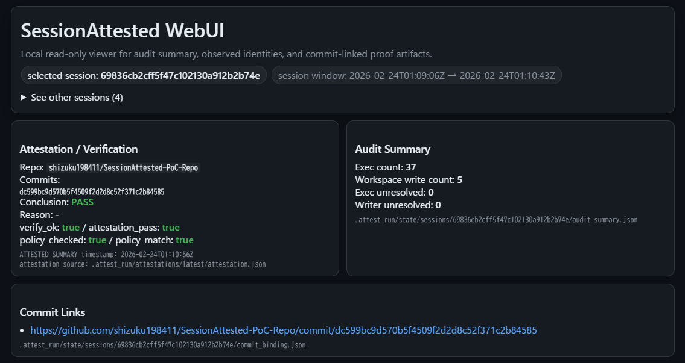
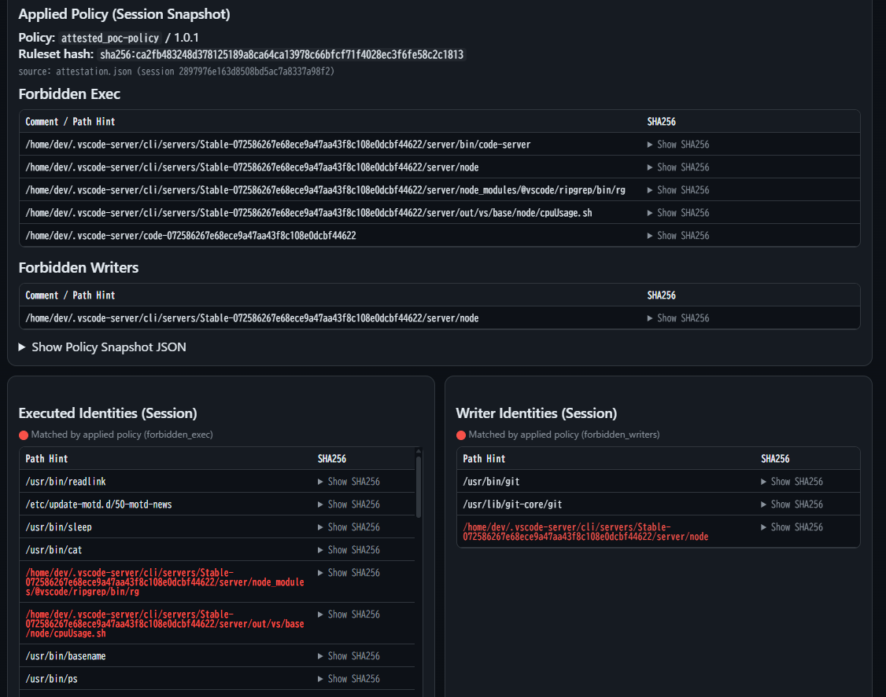

# SessionAttested PoC Repo

This repository is a PoC workspace for development performed with [SessionAttested](https://github.com/shizuku198411/SessionAttested).

[English](./README.md) | [日本語](./README_jp.md)

## Development Flow

### Workspace Registration (Host side)
Run `attested workspace init` in the working directory and configure the workspace interactively.

```bash
$ attested workspace init

# Arbitrary WorkspaceID
workspace name (workspace-id): attested_poc
# Workspace path, CWD is auto-filled
workspace path (workspace-host) [/path/to/attested_poc]:
# Dev Container image (by default, a Ubuntu image with SSH support is built)
docker image [attested_base:latest]:
is the image need build or pull? [pull|build] (default: build): 
# Whether to use the host SSH key for git push inside the Dev Container
mount host git ssh key into container? [y/N]: y
host ssh private key path [/path/to/.ssh/github_id_key]: 
# GitHub repository / user information
GitHub repo (owner/name) [optional]: shizuku198411/SessionAttested-PoC-Repo    
git user.name [optional]: shizuku198411
git user.email [optional]: <EMAIL>

workspace_id: attested_poc
workspace_meta: /path/to/attested_poc/.attest_run/state/workspaces/attested_poc.json
workspace_host: /path/to/attested_poc
container_id: fe975f3474d71698a219d0c4c424d5a2b6321c0288216830b5271895ff86ac8e
container_name: attested-poc-dev
created: true
state: container is created/registered and left stopped
scaffold:
  created: .gitignore (managed block)
  created: attest/attested.yaml
  created: attest/Dockerfile
  created: attest/policy.yaml
```

This performs:

- creation of config/files/directories used for auditing in this repository
- creation of the Dev Container

You can confirm the Dev Container instance with `docker container ls -a`.

```bash
$ docker container ls -a
CONTAINER ID   IMAGE                  COMMAND                  CREATED         STATUS                    PORTS     NAMES
fe975f3474d7   attested_base:latest   "/usr/sbin/sshd -D -e"   4 minutes ago   Created                             attested-poc-dev
```

### Session Start (Host side)
Run `attested start` to start the Dev Container and begin auditing.

```bash
$ attested start
session_id: 2db0423d7d36c88c7e03e61d5d3c7234
session_dir: .attest_run/state/sessions/2db0423d7d36c88c7e03e61d5d3c7234
workspace_host: /path/to/attested_poc
container_id: fe975f3474d71698a219d0c4c424d5a2b6321c0288216830b5271895ff86ac8e
image: attested_base:latest
container_reused: true
meta: .attest_run/state/sessions/2db0423d7d36c88c7e03e61d5d3c7234/meta.json
collector_auto: true
collector_pid: .attest_run/state/sessions/2db0423d7d36c88c7e03e61d5d3c7234/collector.pid
collector_log: .attest_run/state/sessions/2db0423d7d36c88c7e03e61d5d3c7234/collector.log
generated_signing_key: .attest_run/keys/attestation_priv.pem
generated_public_key: .attest_run/keys/attestation_pub.pem
```

This starts both audit log collection (`attested collector`) and the Dev Container.

### Development Work (Dev Container side)
From here, the workflow is normal development work.

#### Connection methods

You can use any of the following:

- `docker container exec`
- SSH from a terminal
- SSH from an IDE

SessionAttested's audit architecture does not restrict the developer's tools or connection method.

If connecting via SSH, the initial user/password is `dev:devpass`.

#### Git initialization
This can be done on either the host or inside the container. In this PoC, it is done inside the container.

```bash
dev@fe975f3474d7:/workspace$ git init
dev@fe975f3474d7:/workspace$ git remote add origin git@github.com:shizuku198411/SessionAttested-PoC-Repo.git
dev@fe975f3474d7:/workspace$ git branch -M main
```

#### Package installation & file creation
In this session, package installation (`apt`) and file creation are performed.

```bash
dev@fe975f3474d7:/workspace$ sudo apt update
dev@fe975f3474d7:/workspace$ sudo apt install -y ca-certificates curl
dev@fe975f3474d7:/workspace$ mkdir src
dev@fe975f3474d7:/workspace$ touch src/main.c
# edit files with IDE
```

#### Git Commit
To bind the session to audit logs, use the `attested git` wrapper inside the container.

`attested git` = `git` command wrapper + audit-log/session mapping support.

```bash
dev@fe975f3474d7:/workspace$ attested git add .
dev@fe975f3474d7:/workspace$ attested git commit -m 'first commit'
# == normal git output ==
[main (root-commit) 7c64b24] first commit
 10 files changed, 228 insertions(+)
 create mode 100644 .attest_run/keys/attestation_pub.pem
 create mode 100644 .attest_run/last_session_id
 create mode 100644 .attest_run/state/sessions/2db0423d7d36c88c7e03e61d5d3c7234/collector.pid
 create mode 100644 .attest_run/state/sessions/2db0423d7d36c88c7e03e61d5d3c7234/meta.json
 create mode 100644 .gitignore
 create mode 100644 README.md
 create mode 100644 attest/Dockerfile
 create mode 100644 attest/attested.yaml
 create mode 100644 attest/policy.yaml
 create mode 100644 src/main.c
# == SessionAttested commit binding ==
committed
repo_path: .
commit_sha: 7c64b24d7504aa1b2ac361d57cd6a8e66a2aae1d
binding: .attest_run/state/sessions/2db0423d7d36c88c7e03e61d5d3c7234/commit_binding.json
bindings: .attest_run/state/sessions/2db0423d7d36c88c7e03e61d5d3c7234/commit_bindings.jsonl
```

This records the Session-to-Commit binding.

### Session End (Host side)
When work is complete, run `attested stop` to close the session.

```bash
$ attested stop
finalized
stopped_container: true
audit_summary: .attest_run/state/sessions/2db0423d7d36c88c7e03e61d5d3c7234/audit_summary.json
event_root: .attest_run/state/sessions/2db0423d7d36c88c7e03e61d5d3c7234/event_root.json
```

This notifies the collector that the session ended and finalizes the session audit logs.

### Attest (Evaluation) (Host side)
Run `attested attest` on the finalized audit logs. The initial policy (`attest/policy.yaml`) is empty, meaning all exec/writer identities are allowed.

```bash
$ attested attest
wrote:
  .attest_run/attestations/latest/attestation.json
  .attest_run/attestations/latest/attestation.sig
  .attest_run/attestations/latest/attestation.pub
attestation pass=true
```

The evaluation is PASS, and the result is stored as a signed proof in `attestation.json`.

### Verify (Verification) (Host side)
Run `attested verify` to check the signed proof integrity and place verification markers.

```bash
$ attested verify
OK (signature valid, policy match). attestation pass=true
```

This verifies:

- signature validity (detects `attestation.json` tampering)
- policy match (detects policy tampering)

It also writes the following files at the repository root:

- [ATTESTED](ATTESTED): SessionAttested marker
- [ATTESTED_SUMMARY](ATTESTED_SUMMARY): cumulative per-session verify summary
- [ATTESTED_POLICY_LAST](ATTESTED_POLICY_LAST): most recently used policy content
- [ATTESTED_WORKSPACE_OBSERVED](ATTESTED_WORKSPACE_OBSERVED): cumulative observed exe/writer identities in the workspace

### Push to GitHub (Container side / Host side)
Push can be performed either from the Dev Container or from the host.

In this PoC, the assumed operational policy is: the auditor (host side) confirms PASS via attest/verify before pushing.

Commit and push the generated signed-proof-related files.
If working on the host side, this is considered “proof placement work” rather than development work, so use normal `git commit` instead of `attested git commit`.

```bash
$ git add .
$ git commit -m 'attested verify: pass'
[main 159e787] attested verify: pass
 13 files changed, 1552 insertions(+), 1 deletion(-)
 create mode 100644 .attest_run/attestations/latest/attestation.json
 create mode 100644 .attest_run/attestations/latest/attestation.pub
 create mode 100644 .attest_run/attestations/latest/attestation.sig
 create mode 100644 .attest_run/state/sessions/2db0423d7d36c88c7e03e61d5d3c7234/audit_summary.json
 delete mode 100644 .attest_run/state/sessions/2db0423d7d36c88c7e03e61d5d3c7234/collector.pid
 create mode 100644 .attest_run/state/sessions/2db0423d7d36c88c7e03e61d5d3c7234/collector.stop
 create mode 100644 .attest_run/state/sessions/2db0423d7d36c88c7e03e61d5d3c7234/commit_binding.json
 create mode 100644 .attest_run/state/sessions/2db0423d7d36c88c7e03e61d5d3c7234/commit_bindings.jsonl
 create mode 100644 .attest_run/state/sessions/2db0423d7d36c88c7e03e61d5d3c7234/event_root.json
 create mode 100644 ATTESTED
 create mode 100644 ATTESTED_POLICY_LAST
 create mode 100644 ATTESTED_SUMMARY
 create mode 100644 ATTESTED_WORKSPACE_OBSERVED
$ git push origin main 
Enumerating objects: 37, done.
Counting objects: 100% (37/37), done.
Delta compression using up to 4 threads
Compressing objects: 100% (29/29), done.
Writing objects: 100% (37/37), 15.50 KiB | 2.21 MiB/s, done.
Total 37 (delta 2), reused 0 (delta 0), pack-reused 0
remote: Resolving deltas: 100% (2/2), done.
To github.com:shizuku198411/SessionAttested-PoC-Repo.git
 * [new branch]      main -> main
```

### Repeat Session Start / End / Attest / Verify
Subsequent work is a repetition of the following:

- Session start: `attested start`
- Development in Dev Container: connect / work / `attested git commit`
- Session end: `attested stop`
- Evaluation / verification: `attested attest` / `attested verify`

Since SessionAttested binds to commits, whether or not you push does not affect the audit/attestation result.
Push at any timing that matches your operational policy.

### Workspace Removal
When all development work is complete, run `attested workspace rm` for cleanup.

This command does **not** delete workspace artifacts. It only removes workspace metadata (`.attest_run/state/workspace/`) and the Dev Container instance, so it does not affect your repository contents.

If you want to start sessions again later, begin again from `attested workspace init`.

## Policy Review / Application
SessionAttested identifies executables/writers by inode/dev-based SHA-256 rather than filename alone.
This helps against renamed/moved binaries (version updates, path changes, or path spoofing).

For that reason, the recommended policy workflow is:

### Generate / Apply Candidate Policy
Run `attested policy candidates` to generate a candidate policy from the latest session.

`--include-exec` is recommended.

```bash
$ attested policy candidates --include-exec
wrote: .attest_run/policy.2db0423d7d36c88c7e03e61d5d3c7234.candidate.yaml
next: review and rename if you want to use it as policy
```

This generates a candidate policy containing observed exec/writer identities from the target session.

```yaml
# source: .attest_run/state/sessions/2db0423d7d36c88c7e03e61d5d3c7234/audit_summary.json
# session_id: 2db0423d7d36c88c7e03e61d5d3c7234
policy_id: candidate-2db0423d7d36c88c7e03e61d5d3c7234
policy_version: 1.0.0
forbidden_exec:
    - sha256: sha256:af955ef55333c8fc9c5aa50df91ad1a629d9a79a9afa125cd5e9629585f78015
      comment: /bin/bash
    - sha256: sha256:c883d9c27228339580994a1d0ea960645368c7d1b960a712bd0c655860c2d0d7
      comment: /bin/sh
        :
forbidden_writers:
    - sha256: sha256:c8c89c91b842b5852dea0863836e24d38fec55c263a5b4377e54b40886a1cdb9
      comment: /home/dev/.vscode-server/cli/servers/Stable-072586267e68ece9a47aa43f8c108e0dcbf44622/server/node
exceptions: []
```

At this point, almost everything (including `/bin/bash`) would be forbidden, so trim the file using the `comment` hints and keep only the intended denied tools.

In this PoC, assume an organizational policy that prohibits VS Code usage (e.g., supply-chain risk reduction due to IDE extension vulnerabilities). We keep only VS Code-related executables/writers.
The reviewed policy is shown below.

```yaml
policy_id: attested_poc-deny_vscode
policy_version: 1.0.1
forbidden_exec:
    - sha256: sha256:ee2d5f97c1dbc39fc28f66383e173ffae55420512ec0f420ff46758e2f1111c9
      comment: /home/dev/.vscode-server/cli/servers/Stable-072586267e68ece9a47aa43f8c108e0dcbf44622/server/bin/code-server
    - sha256: sha256:c8c89c91b842b5852dea0863836e24d38fec55c263a5b4377e54b40886a1cdb9
      comment: /home/dev/.vscode-server/cli/servers/Stable-072586267e68ece9a47aa43f8c108e0dcbf44622/server/node
    - sha256: sha256:26ce6cceb17ac710ee7253c49ea825c618d4f9e49a135d52b4edce336c40f620
      comment: /home/dev/.vscode-server/cli/servers/Stable-072586267e68ece9a47aa43f8c108e0dcbf44622/server/node_modules/@vscode/ripgrep/bin/rg
    - sha256: sha256:2bfe7e6f1939a446c2a4d21998202a247ce58edb1890e10d97b633a91e5a71b5
      comment: /home/dev/.vscode-server/cli/servers/Stable-072586267e68ece9a47aa43f8c108e0dcbf44622/server/out/vs/base/node/cpuUsage.sh
    - sha256: sha256:b5bcad68e567f13e111d24b5dc9a7abc544b4dc81c4817ab5518789461581ac6
      comment: /home/dev/.vscode-server/code-072586267e68ece9a47aa43f8c108e0dcbf44622
forbidden_writers:
    - sha256: sha256:c8c89c91b842b5852dea0863836e24d38fec55c263a5b4377e54b40886a1cdb9
      comment: /home/dev/.vscode-server/cli/servers/Stable-072586267e68ece9a47aa43f8c108e0dcbf44622/server/node
exceptions: []
```

Apply this policy to `attest/policy.yaml` (rename or copy/paste).
Also, incrementing `policy_version` is recommended so it is easy to confirm which policy version was applied in later sessions.

## Behavior Verification After Policy Update
After setting VS Code-related binaries as forbidden exec/writers, this PoC runs two development sessions:

- Case1: compliant session (no VS Code)
- Case2: violating session (VS Code Remote SSH used)

### Case1: Policy-Compliant Development Session (No VS Code)
Connect to the Dev Container via SSH from Windows Terminal and work there.

```bash
$ attested start

# == Connect from Windows Terminal, work + attested git commit ==

$ attested stop
$ attested attest
wrote:
  .attest_run/attestations/latest/attestation.json
  .attest_run/attestations/latest/attestation.sig
  .attest_run/attestations/latest/attestation.pub
attestation pass=true
pyxgun@develop:~/sandbox/attested_poc$ attested verify
OK (signature valid, policy match). attestation pass=true
```

The verification result is PASS, showing there was no policy violation in this session.

To confirm that the intended policy version was actually applied, check:

- `ATTESTED_POLICY_LAST`: most recently applied policy contents
- `ATTESTED_SUMMARY`: policy version and evaluation result recorded for the session

Example `ATTESTED_SUMMARY` entry for this case:

```yaml
  {
    "attestation_pass": true,
    "commit_sha": [
      "dc599bc9d570b5f4509f2d2d8c52f371c2b84585"
    ],
    "commit_url": [
      "https://github.com/shizuku198411/SessionAttested-PoC-Repo/commit/dc599bc9d570b5f4509f2d2d8c52f371c2b84585"
    ],
    "policy_checked": true,
    "policy_id": "attested_poc-policy",
    "policy_match": true,
    "policy_path": "attest/policy.yaml",
    "policy_version": "1.0.1",
    "repo": "shizuku198411/SessionAttested-PoC-Repo",
    "ruleset_hash": "sha256:ca2fb483248d378125189a8ca64ca13978c66bfcf71f4028ec3f6fe58c2c1813",
    "session_id": "69836cb2cff5f47c102130a912b2b74e",
    "timestamp": "2026-02-24T01:10:56Z",
    "verify_ok": true
  }
```

This confirms the VS Code-deny policy (`policy_version: 1.0.1`) was used and the session still passed.

### Case2: Policy-Violating Development Session (Using VS Code)
Next, connect to the Dev Container from VS Code (Remote SSH) and work there.

```bash
$ attested start

# == Connect from VS Code, work + attested git commit ==

$ attested stop

$ attested attest
wrote:
  .attest_run/attestations/latest/attestation.json
  .attest_run/attestations/latest/attestation.sig
  .attest_run/attestations/latest/attestation.pub
attestation pass=false
$ attested verify
NG (FORBIDDEN_EXEC_SEEN: count=5 samples=[sha256:26ce6cceb(/home/dev/.vscode-server/cli/servers/Stable-072586267e68ece9a47aa43f8c108e0dcbf44622/server/node_modules/@vscode/ripgrep/bin/rg), sha256:2bfe7e6f1(/home/dev/.vscode-server/cli/servers/Stable-072586267e68ece9a47aa43f8c108e0dcbf44622/server/out/vs/base/node/cpuUsage.sh), sha256:b5bcad68e(/home/dev/.vscode-server/code-072586267e68ece9a47aa43f8c108e0dcbf44622), sha256:c8c89c91b(/home/dev/.vscode-server/cli/servers/Stable-072586267e68ece9a47aa43f8c108e0dcbf44622/server/node), sha256:ee2d5f97c(/home/dev/.vscode-server/cli/servers/Stable-072586267e68ece9a47aa43f8c108e0dcbf44622/server/bin/code-server)]). attestation pass=false
```

`FORBIDDEN_EXEC_SEEN` shows the session violates the policy.
The CLI output focuses on exec violations, so inspect `.attest_run/attestations/latest/attestation.json` for the full conclusion details.

```yaml
  "conclusion": {
    "pass": false,
    "reasons": [
      {
        "code": "FORBIDDEN_EXEC_SEEN",
        "detail": "count=5 samples=[sha256:26ce6cceb(/home/dev/.vscode-server/cli/servers/Stable-072586267e68ece9a47aa43f8c108e0dcbf44622/server/node_modules/@vscode/ripgrep/bin/rg), sha256:2bfe7e6f1(/home/dev/.vscode-server/cli/servers/Stable-072586267e68ece9a47aa43f8c108e0dcbf44622/server/out/vs/base/node/cpuUsage.sh), sha256:b5bcad68e(/home/dev/.vscode-server/code-072586267e68ece9a47aa43f8c108e0dcbf44622), sha256:c8c89c91b(/home/dev/.vscode-server/cli/servers/Stable-072586267e68ece9a47aa43f8c108e0dcbf44622/server/node), sha256:ee2d5f97c(/home/dev/.vscode-server/cli/servers/Stable-072586267e68ece9a47aa43f8c108e0dcbf44622/server/bin/code-server)]"
      },
      {
        "code": "FORBIDDEN_WRITER_SEEN",
        "detail": "count=1 samples=[sha256:c8c89c91b(/home/dev/.vscode-server/cli/servers/Stable-072586267e68ece9a47aa43f8c108e0dcbf44622/server/node)]"
      }
    ]
  },
```

This shows both forbidden execs and a forbidden writer were detected in the session.

## Reviewing Workspace Audit Logs via WebUI
All audit logs can be inspected as files, but SessionAttested also provides a WebUI for easier review.
Start the WebUI with:

```bash
$ attested webui --addr 0.0.0.0:9443
```

Use `--addr` to choose the port and bind address.
After startup, access `https://<host>:<port>` in your browser (TLS uses a self-signed certificate).

After loading the page, the latest session result is shown. You can switch sessions via **"See other sessions (n)"**.


### WebUI Result for Case1
The Case1 session appears like this:



- `conclusion: PASS` = evaluation and verification succeeded
- `verify_ok/attestation_pass: true` = no policy violation and verification succeeded
- `policy_checked/policy_match: true` = the policy used for evaluation was the intended one and was not tampered with

### WebUI Result for Case2
The Case2 session appears like this:


- `conclusion: FAIL` = evaluation and/or verification failed
- `Reason: FORBIDDEN_EXEC_SEEN` = failed due to forbidden executable detection
- `verify_ok/attestation_pass: false` = policy violation detected
- `policy_checked/policy_match: true` = the intended policy was used and matched (no tampering)

This means:

- the defined policy was applied as intended and not tampered with, and
- executables prohibited by that policy were detected.

Detailed exe/writer lists are shown lower on the page.



The page shows both the applied policy and detected executables/writers (`Executed/Writer Identities`).
Items that violate the policy are highlighted.

In `v0.1.2`, the WebUI also includes:

- `Workspace Files -> Writers (Session)`
- `Files Touched by Forbidden Exec Lineage (Session)`
- `Commit Files -> Writers (Session)`

This makes it easier to explain:

- which commit file was changed
- which write comm / writer was involved
- whether the file correlates to forbidden-exec lineage (`exec`) and/or forbidden writer (`writer`)

`Match Kind` in the `Commit Files -> Writers (Session)` card means:

- `exec`
  - the file write is correlated to a forbidden executable lineage (PID/PPID ancestry),
  - but the resolved writer identity itself did not match `forbidden_writers`
- `writer`
  - the resolved writer identity matched `forbidden_writers`,
  - but forbidden-exec lineage correlation was not found for that file write
- `exec+writer`
  - both of the above are true (lineage correlation + forbidden writer identity match)


For practical operation, the recommended usage split is:

- Raw logs: evidence retention / later re-validation (e.g., artifact storage)
- WebUI: quick PASS/FAIL review per session, policy-violating exe/writer confirmation, policy tuning/review
