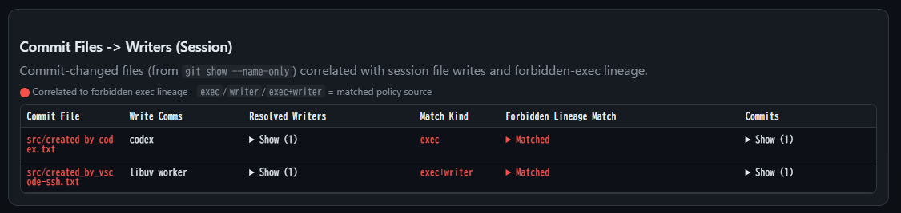
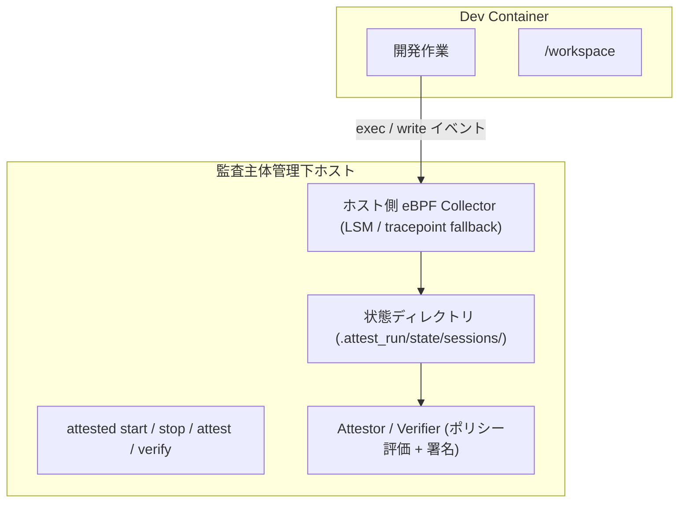

# Project Overview

[日本語](./PROJECT_OVERVIEW.md) | [English](../../PROJECT_OVERVIEW.md)

このドキュメントは、トップ README から切り出した詳細情報（背景、ユースケース、強み、監査結果の見方）をまとめたものです。

## ステータス（PoC）

- 主判定: `forbidden_exec`
- 補助判定: `forbidden_writers`
- 拡張判定: `forbidden_exec_lineage_writes`

## 監査結果（WebUI）

SessionAttested は、以下を記録・可視化します。
- `audit_summary.json`
- `attestation.json`
- `ATTESTED_SUMMARY`
- `ATTESTED_WORKSPACE_OBSERVED`
- `.attest_run/reports/sessions/<SESSION_ID>/session_correlation.json`

代表的な WebUI カード:
- Attestation / Verification
- Audit Summary
- Executed / Writer identities
- Workspace Files -> Writers (Session)
- Files Touched by Forbidden Exec Lineage (Session)
- Commit Files -> Writers (Session)

表示イメージ（スクリーンショット）:

セッション一覧と PASS/FAIL 概要:

FAIL ケースの詳細:

Commit 相関表示:

## 監査アーキテクチャ（PoC）

## スコープ

提供するもの:
- ホスト側セッション監査（`exec`, workspace write）
- commit 紐づけ
- 署名付き証明 + verify
- ポリシーベースの pass/fail 判定

証明しないもの:
- 監査対象外環境での行為まで含む絶対的な非利用証明
- コード品質や本人性の単独証明

## ユースケース

- 禁止ツール検知/検証
- ポートフォリオ・採用時の補助証跡
- 受託開発の作業プロセス統制
- 教育/試験での補助監査
- 組織内コンプライアンス

## 強み（既存手法との関係）

SessionAttested は EDR/XDR、ネットワーク監査、CI 静的検査を置き換えるものではなく、補完レイヤです。

価値の中心:
- セッション単位に監査対象を絞れる
- 開発行為に近いプロセス証跡を扱える
- commit 紐づけ済みで署名検証可能な成果物を出せる

## 関連ドキュメント

- [`ATTESTATION_FLOW.md`](ATTESTATION_FLOW.md)
- [`ATTESTATION_SCHEMA_EXAMPLES.md`](ATTESTATION_SCHEMA_EXAMPLES.md)
- [`EVENT_COLLECTION.md`](EVENT_COLLECTION.md)
- [`SIGNING_AND_TAMPER_RESISTANCE.md`](SIGNING_AND_TAMPER_RESISTANCE.md)
- [`THREAT_MODEL.md`](THREAT_MODEL.md)
- [`POLICY_GUIDE.md`](POLICY_GUIDE.md)
