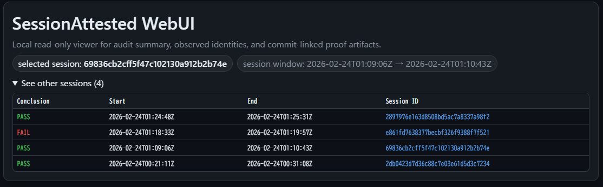
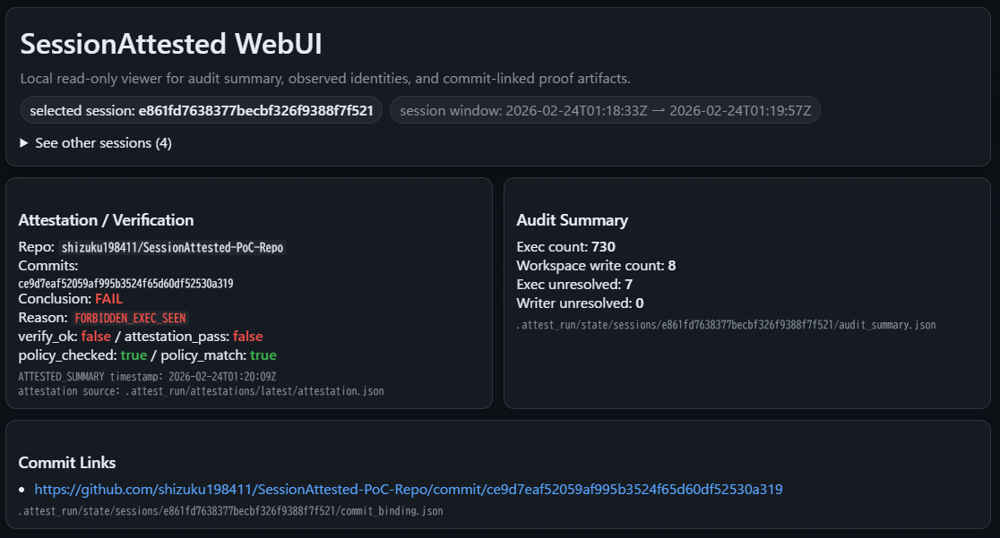
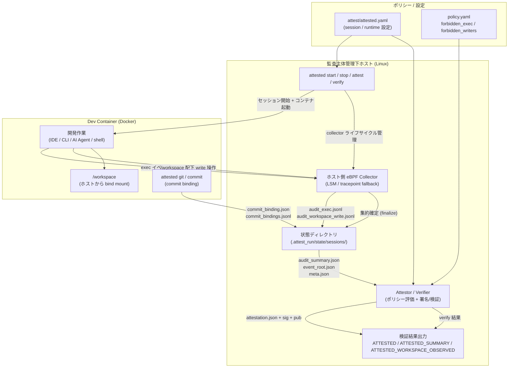

# SessionAttested

[日本語](./README.md) | [English](../../README.md)


**SessionAttested** は、開発セッション中に「どのプロセスが実行され、どの実行体がワークスペースへ書き込んだか」をホスト側監査（LSM/eBPF）で観測し、その結果をコミットに紐付けて署名付き証明として出力する、**ポリシーベースの開発セッション証明フレームワーク** です。

本プロジェクトは、**検証可能な開発セッション監査とポリシー運用の基盤** として利用できます。  
つまり、**禁止プロセスが実行されていないこと / 許可された実行体のみが書き込みを行ったこと** を、管理下セッションについて検証可能な形で提示するための基盤です。

## SessionAttested による監査結果イメージ（WebUI）

SessionAttested では、`audit_summary.json` / `attestation.json` / `ATTESTED_SUMMARY` / `ATTESTED_WORKSPACE_OBSERVED` などの監査結果が記録されます。これらは、ローカル HTTPS WebUI（`attested webui`）で視覚的に確認できます。

WebUI で確認できる監査結果（例）:

- セッション単位の評価/検証結果（`PASS` / `FAIL`）
- 監査サマリ（`exec` / `workspace write` 件数、未解決件数）
- 実行体/書き込み主体一覧（ポリシーマッチ時のハイライト付き）
- Workspace 累積観測一覧（`ATTESTED_WORKSPACE_OBSERVED`）
- 適用ポリシー（セッションスナップショット）や commit リンク

表示例（セッション一覧 + PASS/FAIL 概要）:



表示例（FAIL ケース / VS Code 禁止ポリシー適用時）:



## 監査アーキテクチャ（PoC）



この図で分かること（概要）:

- **どこで監査するか:** コンテナ内ではなくホスト側
- **何を観測するか:** `exec` と `/workspace` 配下の write
- **何を集約するか:** 生ログ + 監査サマリ + `event_root`
- **何が出力されるか:** 署名付き証明（`attestation.json` など）と verify 結果（`ATTESTED`, `ATTESTED_SUMMARY`）

## 背景

開発環境には多様なツール（AI Agent、コード生成器、ダウンローダ、独自スクリプト等）が存在し、後から「どのプロセスが実行され、どの主体がワークスペースを書き換えたか」を客観的に説明することは難しい場合があります。

そこで本プロジェクトでは、以下のような主張を機械的に検証可能な形で提示することを目的とします。

- 対象ワークスペース配下への書き込みは許可されたプロセス集合からのみ発生した
- 禁止プロセス（AI Agent 類を含む）の実行・書き込みは観測されなかった
- 監査結果は改ざん困難な形で集約され、電子署名されている

## スコープ

### 本プロジェクトで保証したいこと
- 監査主体が管理するホスト上で実行される、被監査主体のコンテナ環境（PoCでは Docker）において、
  - `exec`（プロセス実行）と
  - `/workspace` 配下への write 系操作
  をホスト側で監査する
- コミット（commit SHA）に対して、監査結果を要約した署名付き証明を生成する
- 生成された署名付き証明は GitHub Artifact として配布できる形式を想定する（PoCではローカル生成も可）
- ポリシー（`forbidden_exec`, `forbidden_writers`）に基づき、セッションの pass/fail を判定する

### 本プロジェクトが証明しないこと
- 「ある種のツールを一切利用していない」こと一般（例：人が別環境で生成した結果を手で持ち込む行為）
- コピペ検出・プロンプト履歴の追跡
- ユーザが管理するホスト上（self-hosted）の完全性保証
  - 本設計は監査主体の管理下にあるホストでの監査を前提にする

## 監査記録のイメージ

SessionAttested では、セッション終了後に主に以下のような成果物が得られます。

- 生ログ（時系列）
  - `audit_exec.jsonl` : `exec` イベント
  - `audit_workspace_write.jsonl` : `/workspace` への write イベント
- 集約結果
  - `audit_summary.json` : 件数、実行体/書き込み主体 identity 集約、未解決件数
  - `event_root.json` : イベント集合の hash 集約
- commit / 証明
  - `commit_binding.json` / `commit_bindings.jsonl`
  - `attestation.json`（署名対象本体）
  - `ATTESTED`, `ATTESTED_SUMMARY`（verify 結果）

### 生ログの例（`audit_exec.jsonl`）

```json
{"pid":306427,"comm":"sh","filename":"/home/dev/.vscode-server/.../server/node"}
{"pid":306433,"comm":"node","filename":"/home/dev/.vscode-server/.../server/bin/code-server"}
```

見えること:

- どのプロセス名（`comm`）で
- どの実行体（`filename`）が
- いつ/どの PID で実行されたか

### 生ログの例（`audit_workspace_write.jsonl`）

```json
{"pid":309289,"comm":"libuv-worker","filename":"/workspace/src/created_by_vscode-ssh.txt","op":"open_write"}
{"pid":309290,"comm":"bash","filename":"/workspace/src/created_by_winterm-ssh.txt","op":"open_write"}
```

見えること:

- `/workspace` 配下のどのファイルに
- どのプロセスが write 系操作を行ったか

### 集約結果の例（`audit_summary.json`）

```json
{
  "exec_observed": {"count": 1438},
  "workspace_writes_observed": {"count": 9},
  "executed_identities": [{"sha256": "sha256:...","path_hint": "/home/dev/.vscode-server/.../server/node"}],
  "writer_identities": [{"sha256": "sha256:...","path_hint": "/home/dev/.vscode-server/.../server/node"}]
}
```

見えること:

- 生ログを全部読まなくても、セッション全体の傾向を把握できる
- `forbidden_exec` / `forbidden_writers` で評価するための入力が揃う

### 検証結果の例（`ATTESTED_SUMMARY`）

```json
{
  "session_id": "e861fd7638377becbf326f9388f7f521",
  "verify_ok": false,
  "attestation_pass": false,
  "reason": "FORBIDDEN_EXEC_SEEN: count=5 samples=[sha256:...(.../server/node), ...]"
}
```

見えること:

- verify 自体が通ったか
- policy 判定として pass/fail か
- fail の理由（違反 identity のサンプル付き）

詳細な schema / フィールド説明は `ATTESTATION_SCHEMA_EXAMPLES.md` を参照してください。

## PoC時点の有用性（現状評価）

PoC段階でも、SessionAttested は以下の意味で実用的な監査フロー/状況証拠になります。

- `exec` と `workspace write` を分離して監査できる
- `forbidden_exec` による fail 判定を、実セッション・実コミットに紐づけて再現できる
- 監査結果を `attestation.json` / `verify` / `ATTESTED_SUMMARY` として残せる
- VS Code Remote など現実的な開発環境でも、writer/exe identity を一定精度で取得できる

本プロジェクトが主に提供する価値は「完全な行為証明」ではなく、**監査主体管理下セッションにおける、ポリシーベースの高信頼な状況証拠と検証フロー** である点です。

実運用上は、以下の位置づけが現実的です。

- `forbidden_exec` : 主判定（禁止ツール実行の検知）
- `forbidden_writers` : 補助判定（書き込み主体の補強証跡）

## 運用上の所感（v0.1.1）

スクリプトによる e2e だけでなく、実際の開発作業に組み込んで使った所感として、PoC 段階でも再現性のある監査フローとして十分実用的です。

### 1. 開発フローの定型化がしやすい

以下のような流れをそのまま開発手順に組み込めます。

1. `attested workspace init`（監査主体）
2. `attested start`（監査主体）
3. Dev Container 内で作業 + `attested git commit`（被監査主体）
4. `attested stop` + `attested attest` / `attested verify`（監査主体）
5. 2～3を繰り返す
6. `attested workspace rm` (監査主体)

セッション単位の監査・評価・署名が一貫した形で運用しやすくなります。

### 2. Git Push のタイミングを運用ポリシーで選べる

Git Push は以下のどちらでも実施できます。

- 被監査主体が Dev Container 内で実施する
- 監査主体が `verify` の pass を確認した後に実施する

監査モデルを変えずに、運用ルールに応じた柔軟なフローを組める点が実用的です。

### 3. 引数なしの単一コマンド実行で扱いやすい

`./attest/attested.yaml` や `.attest_run/last_session_id` の自動読込により、多くの操作を引数なしで実行できます。日常的な運用時の手間や指定ミスを減らしやすく、直感的に扱えます。

### 4. 個人開発でも監査として有用

監査主体 = 被監査主体となる個人開発であっても、監査ログの一貫性や改ざん困難性により、後から確認できる証跡として有用です。

`forbidden_*` を空にしている場合でも、以下を確認することで:

- `ATTESTED_WORKSPACE_OBSERVED`
- `attestation.json`

workspace 全体でどの exe / writer が観測されたかを、後から追跡できます。

### 5. 開発作業の妨げになりにくい

監査はホスト側で実行され、被監査主体は独立した Dev Container 内で作業するため:

- 被監査主体はコンテナ内で任意のツール導入・スクリプト実行を継続しやすい
- ホスト側への影響を最小化しやすい
- Proxy / Agent 常駐型の監査に比べて IDE 制約が小さい（VS Code 系ワークフローも扱いやすい）

実運用上の制約は、監査主体が設定する workspace/container 構成（例: 公開ポートやネットワーク設定）の影響が中心であり、被監査主体の開発体験を大きく阻害しにくい点が強みです。

## ユースケース

SessionAttested は、特定のツールに限定したものではなく、**開発セッションに対するポリシーベース監査 / 検証基盤** として使うのが本質に近いです。  
PoC 時点では、以下のような用途を想定しています。

### 1. 禁止ツール実行の検知・検証（AI Agent / ダウンローダ等）

- `forbidden_exec` に AI Agent（例: Codex 系実行体）を登録し、実行セッションを fail にする
- `forbidden_exec` にダウンローダや特定 CLI（`curl` / `wget` / 独自バイナリ等）を登録し、外部取得を伴う作業を fail にする
- `forbidden_writers` を補助として使い、「禁止ツールが実際に workspace を書き換えた」ケースの証拠を強化する

### 2. ポートフォリオ/採用選考での実装スキル証明（補助証跡）

- 「この実装は監査対象セッション内で作業した」ことを commit と署名付き証明で紐付けて提示する
- `ATTESTED_SUMMARY` によって、verify 済みの履歴をリポジトリ側へ残す
- 「禁止ツール未使用（または組織ルール準拠）」という主張の補助証跡として使う

注意:
- これは成果物の品質や本人性を単独で証明するものではなく、**作業プロセスに関する状況証拠** の位置づけ

### 3. 外注・受託開発における作業条件の確認

- 発注側が「特定ツールの利用禁止」「特定ツールのみ許可」といった方針を定める
- 受託側/被監査主体は、管理下セッションでの作業結果に署名付き証明を添付して提出する
- 納品物レビューとは別に、作業プロセス面のチェック材料として利用する

### 4. 教育・試験・トレーニング環境での補助監査

- 演習/試験時に「禁止ツール（生成AI、外部取得ツール等）」をポリシー化
- 提出時に署名付き証明を添付させ、ルール違反の一次チェックを自動化する
- 完全防止ではなく、監査ログに基づく事後確認フローとして使う

### 5. 組織内の開発コンプライアンス/監査証跡整備

- 高リスクな補助ツールや未承認ツールの利用状況を、セッション単位で可視化する
- CI/CD に `verify` を組み込み、ルール違反セッション由来の成果物を fail にする
- 署名付き証明をアーカイブし、後日監査時の証跡として扱う

### 6. セキュリティ重視開発での「証明可能な手順」補強

- 重要変更（例: 認証・鍵管理・決済周辺）に限定して SessionAttested を適用する
- 「誰がいつ作業したか」ではなく、「どの実行体が動いたか」を重視したプロセス証跡として使う
- 変更管理/レビュー記録と組み合わせて、説明可能性を上げる

### 7. ポリシー設計/運用の検証環境（本PoCに該当）

- `attested policy candidates` で候補 policy を生成し、監査対象/禁止対象の設計を試す
- 実環境の editor / IDE / extension の挙動差（`comm` や writer identity の見え方）を確認する
- 将来の deny モード/LSM 制御に向けた観測データ基盤として使う

## 本プロジェクトの強み（従来手法との比較）

以下は、既存の監査・制御手法を否定するものではなく、**それらの不足を SessionAttested が補完しやすい点** を整理したものです。

### 1. ホスト側 EPP / XDR 監査

- 従来の方法:
  - ホスト全体のプロセス実行、検知イベント、ふるまいを EPP/XDR で監視する
- 欠点:
  - 開発セッション単位（どのコンテナ/どの commit に対応するか）での紐づけが弱い
  - 開発ワークスペースへの書き込みと、禁止ツール実行の関係を直接示しにくい
  - 証跡をそのまま開発成果物の検証フローに載せにくい
- SessionAttestedでの対応/解決方針:
  - `session_id` を軸に `exec` / `workspace write` を集約
  - commit binding により commit SHA と紐づけ
  - `attestation.json` / `verify` により開発フロー側で検証可能な形式へ変換

### 2. ネットワークレイヤ監査（FW / Proxy / DNS / NDR）

- 従来の方法:
  - 通信先、通信量、プロトコル、ドメイン解決などを監査する
- 欠点:
  - 「何のプロセスが」「どのファイル変更のために」通信したかが直接分からない
  - オフライン動作/ローカルバイナリ実行（AI Agent/生成器含む）は見えにくい
  - 許可/不許可の判断が通信先中心になり、開発行為との距離がある
- SessionAttestedでの対応/解決方針:
  - 通信の代わりに開発行為に近い `exec` / `workspace write` を監査対象にする
  - 禁止ツールの実行体 hash を `forbidden_exec` で直接判定する
  - ネットワーク監査は補完手段として併用可能

### 3. アプリケーションログ / シェル履歴ベース監査

- 従来の方法:
  - shell history、CLI ログ、アプリ独自ログを収集する
- 欠点:
  - 改ざんや欠落に弱い（設定依存、履歴無効化、ログ出力差）
  - GUI 操作や IDE 拡張経由の実行/書き込みを取りこぼしやすい
  - 実行体の実体（hash）ではなく、コマンド文字列中心になりがち
- SessionAttestedでの対応/解決方針:
  - ホスト側 eBPF で syscall 近傍のイベントを収集
  - `sha256` ベースの identity 集約（`executed_identities`, `writer_identities`）
  - `event_root` + 署名で署名付き証明の改ざん検知を可能にする

### 4. コンテナ内自己申告型エージェント/監査デーモン

- 従来の方法:
  - コンテナ内に監査プロセスを入れてログを送る
- 欠点:
  - 被監査主体が制御できる領域に監査機構が存在するため、信頼境界が弱い
  - コンテナ内で停止/改変されるリスクがある
  - 「監査された」と「実際にそうだった」の距離が縮まりにくい
- SessionAttestedでの対応/解決方針:
  - 監査根拠をホスト側（LSM/eBPF）に置く
  - コンテナ内は作業環境、ホスト側は監査主体という役割分離を明確化
  - 被監査主体から見て改変しにくい位置で観測する

### 5. CI での静的検査のみ（成果物ベース判定）

- 従来の方法:
  - lint / SAST / dependency scan / secret scan など、完成物・リポジトリ状態を検査する
- 欠点:
  - 「どう作られたか（作業プロセス）」は分からない
  - 禁止ツールが使われたかどうかは、成果物だけでは判定困難
  - 後から説明責任を果たすためのプロセス証跡が残りにくい
- SessionAttestedでの対応/解決方針:
  - 作業プロセスをセッション単位で監査し、commit に紐づける
  - CI には `verify` を組み込み、プロセス証跡の検証を追加できる
  - 静的検査と役割分担（成果物品質 + 作業プロセス監査）

### 6. 端末全体ログ監査（OS 監査ログ等）

- 従来の方法:
  - ホスト/端末全体の監査ログを収集して後から調査する
- 欠点:
  - ノイズが多く、対象プロジェクト/対象セッションの切り出しが難しい
  - 開発者・レビューアが日常運用で読める形に落とし込みにくい
  - commit 単位の証明/配布（artifact 化）に繋げにくい
- SessionAttestedでの対応/解決方針:
  - `/workspace` と session を中心に監査範囲を絞る
  - `audit_summary.json` / `attestation.json` / `ATTESTED_SUMMARY` といった開発フロー向け成果物に整形
  - GitHub Artifact 等での配布/検証を想定した形式にする

### 7. なぜコンテナを使うのか（監査対象の切り出し）

- 従来の方法:
  - 開発者のホスト端末全体を監査し、後から対象プロジェクトに関係するイベントを抽出する
- 欠点:
  - 日常利用のプロセス（ブラウザ、チャット、OS 常駐、他プロジェクト作業）が混ざりノイズが多い
  - 「このコミットに関係する作業だけ」を切り出しにくい
  - 監査結果を第三者に提示する際、不要な端末情報を含みやすい
- SessionAttestedでの対応/解決方針:
  - 被監査主体の作業を dev container に集約し、監査対象を `/workspace` と当該コンテナの exec/write に絞る
  - `session_id` とコンテナ情報を使って、対象セッションを明確に切り出す
  - ノイズを減らしつつ、コミットに紐づく監査証跡として扱いやすくする

### 8. SessionAttested の位置づけ（重要）

- SessionAttested は EPP/XDR・FW・CI 静的検査の代替ではなく、**開発セッションのプロセス証跡レイヤ** を補う位置づけ
- 特に強い点は、
  - `どの実行体が動いたか`
  - `どの実行体が workspace を書いたか`
  - `それがどの commit に対応するか`
  を一連の検証フローで扱えること

## 方針（設計の原則）
- 監査の根拠はコンテナ内ではなく **ホスト側（LSM/eBPF）** に置く
- 書き込み元プロセスの同定は **実体（sha256）** を基本とする（名前・パスは補助）
- 監査ログは `session_id` で束ね、commit SHA と結び付けて署名する
- PoCは Docker、最終的に K8s へ拡張可能な形式（session/policy/証明データ）を維持する

## リポジトリ構成

- [`cmd/`](../../cmd/) : CLI エントリポイント（`attested`）
- [`internal/`](../../internal/) : コア実装（collector, attest/verify, state, policy, docker 連携など）
- [`schemas/`](../../schemas/) : JSON Schema（署名付き証明 / 監査イベント）
- [`policy/`](../../policy/) : ポリシー定義（YAML）
- [`example/`](../../example/) : 設定例 / Dockerfile サンプル / GitHub Actions テンプレート
- [`scripts/`](../../scripts/) : 開発・検証用スクリプト（e2e, build など）
- [`SPEC.md`](../../SPEC.md) : 仕様（スキーマ、event root の計算、評価規則、署名）

## 各種ドキュメント

- [`POC_QUICKSTART.md`](POC_QUICKSTART.md) : PoC 利用者向けのビルド・利用手順（最短導線）
- [`CHANGELOG.md`](CHANGELOG.md) : リリースごとの差分（v0.1.1 以降）
- [`ATTESTATION_FLOW.md`](ATTESTATION_FLOW.md) : 監査主体/被監査主体の役割とコマンドベースの署名付き証明フロー
- [`EVENT_COLLECTION.md`](EVENT_COLLECTION.md) : eBPF/collector によるイベント収集の仕組み
- [`SIGNING_AND_TAMPER_RESISTANCE.md`](SIGNING_AND_TAMPER_RESISTANCE.md) : 署名・検証と改ざん困難性の考え方
- [`THREAT_MODEL.md`](THREAT_MODEL.md) : 脅威モデル（何を主張できるか/できないか、信頼前提）
- [`POLICY_GUIDE.md`](POLICY_GUIDE.md) : ポリシー設計・候補生成・レビュー・運用ガイド
- [`ATTESTATION_SCHEMA_EXAMPLES.md`](ATTESTATION_SCHEMA_EXAMPLES.md) : 主要成果物の schema と読み方の例
- [`../../attested_poc/README_jp.md`](../../attested_poc/README_jp.md) : VS Code を禁止ツールとして比較した PoC Workspace 実例（WebUI 画像付き）


## ライセンス

本プロジェクトは [`Apache License 2.0`](LICENSE) の下で公開しています。
